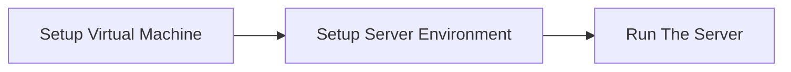

# <heading>MavrickFlats </heading>

 
 

- Creation of Virtual Machine 
    -   [Creation of Virtual Machine using Virt-Manager](#creation-of-virtual-machine-using-virt-manager)
- [Setup Server Environment]()

 

## <subheading>Creation of Virtual Machine using Virt-Manager <subheading>

###
